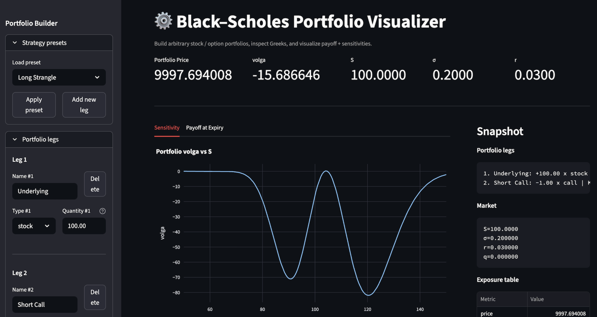
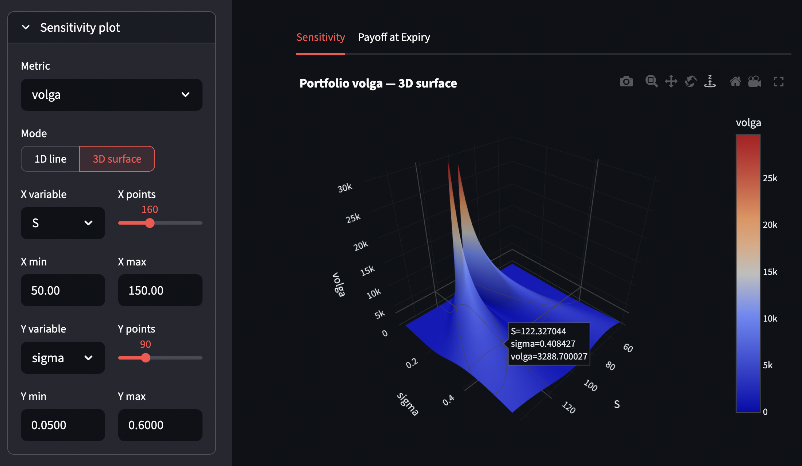

# Option Greeks Plotter

[](https://option-unroller.streamlit.app/)

An interactive **Black–Scholes visualizer** built with **Streamlit** for exploring option prices, payoffs, and Greeks.

This project uses a **finite-difference engine** to compute the Greeks of a given option portfolio under the Black–Scholes model. It handles not only standard first-order Greeks but also **higher order mixed partials** such as Vanna, Volga, and Speed.

Users can plot these Greeks against one or two chosen market variables and see how the curve or surface changes with changing market conditions.

It is useful as an **educational tool** for students, researchers, and quant traders new to the industry.



---

## Greeks Supported



Because option price is a function of multiple variables,

$$
P = P(S, \sigma, T, r, q, K)
$$

the engine computes the following Greeks:

| Greek | Definition |
|------|-------------|
| Price | $P$ |
| Delta | $\partial P / \partial S$ |
| Gamma | $\partial^2 P / \partial S^2$ |
| Vega | $\partial P / \partial \sigma$ |
| Theta | $-\partial P / \partial T$ |
| Rho | $\partial P / \partial r$ |
| Vanna | $\partial^2 P / (\partial S \partial \sigma)$ |
| Volga | $\partial^2 P / \partial \sigma^2$ |
| Charm | $-\partial^2 P / (\partial S \partial T)$ |
| Veta | $-\partial^2 P / (\partial \sigma \partial T)$ |
| Speed | $\partial^3 P / \partial S^3$ |
| Color | $-\partial^3 P / (\partial S^2 \partial T)$ |
| Ultima | $\partial^3 P / \partial \sigma^3$ |
| Zomma | $\partial^3 P / (\partial S^2 \partial \sigma)$ |

More generally, the finite-difference engine can evaluate **arbitrary mixed partial derivatives** of the pricing function.

---

## Technical Overview

This section provides a high-level overview of the core functions and how the system computes option prices and Greeks.

### Core Pricing Engine (`pricing/black_scholes.py`)

#### `BlackScholes._price_value(c, m)`
- Computes the **closed-form Black–Scholes price** for a European option.
- Handles edge cases:
  - Expiry (`T <= 0`) → returns intrinsic value
  - Zero volatility → deterministic forward payoff
- Serves as the **base function** for all Greek calculations.

---

#### `BlackScholes._mixed_diff(base_state, spec, price_from_state)`
- Computes **mixed partial derivatives** using finite differences.
- Takes a derivative specification like:
  - `[("S", 1)]` → Delta  
  - `[("S", 2)]` → Gamma  
  - `[("S", 1), ("sigma", 1)]` → Vanna
- Works by **iteratively wrapping the pricing function**, turning it into its derivative at each step.
- Enables computation of **arbitrary-order Greeks without explicit formulas**.

---

#### `BlackScholes.metric(greek, c, m)`
- Public method to compute a Greek.
- Pipeline:
  1. Convert inputs to a state dictionary
  2. Apply `_mixed_diff(...)`
  3. Adjust sign for market theta convention (`-dP/dT`)
- Returns a single numerical value.

---

#### `BlackScholes.metric_by_key(key, c, m)`
- Convenience wrapper around `metric(...)`.
- Allows users to request Greeks by name (e.g. `"delta"`, `"gamma"`).

---

### Finite Difference Engine (`pricing/diff.py`)

#### `step(x, config)`
- Computes an adaptive step size `h`:
  - Uses both **relative** and **absolute** scaling
- Ensures numerical stability across different magnitudes of variables.

---

#### `finite_diff(f, x0, order, config)`
- Computes numerical derivatives using **central differences**.
- Supports:
  - First-order derivatives
  - Second-order derivatives
  - Higher-order derivatives (via recursion)
- Core mathematical engine behind all Greek calculations.

---

### Data Structures (`pricing/types.py`)

#### `Market`
- Represents market inputs:
  - Spot `S`
  - Volatility `σ`
  - Rate `r`
  - Dividend yield `q`
- Immutable and supports `.with_(...)` for safe modifications.

---

#### `Contract`
- Represents an option:
  - Strike `K`
  - Time to expiry `T`
  - Option type (`call` / `put`)

---

#### `Greek`
- Encodes a Greek as a **derivative specification**:
  - `key`: name (e.g. `"delta"`)
  - `spec`: derivative definition (e.g. `[("S", 1)]`)
  - `theta_market`: applies market convention for time derivatives

---

### Portfolio Layer (Streamlit App)

#### `leg_metric(...)`
- Computes the metric for a single portfolio leg.
- Supports:
  - stock (analytical values)
  - options (via Black–Scholes engine)
- Applies position size (`qty`).

---

#### `portfolio_metric(...)`
- Aggregates metrics across all legs:

```
portfolio_metric = Σ leg_metric(leg_i)
```

---

## Local Installation

Clone the repository and install the dependencies:

```bash
git clone <your-repo-url>
cd <your-repo-folder>
pip install -r requirements.txt
```

Then launch the app:

```bash
streamlit run app.py
```

---

## Project Structure

```
option-unroller/
├── app.py                  # Streamlit UI
├── requirements.txt
└── pricing/
    ├── __init__.py
    ├── types.py            # Market, Contract, Greek dataclasses
    ├── black_scholes.py    # Black–Scholes engine + Greek registry
    └── diff.py             # Finite-difference engine
```
